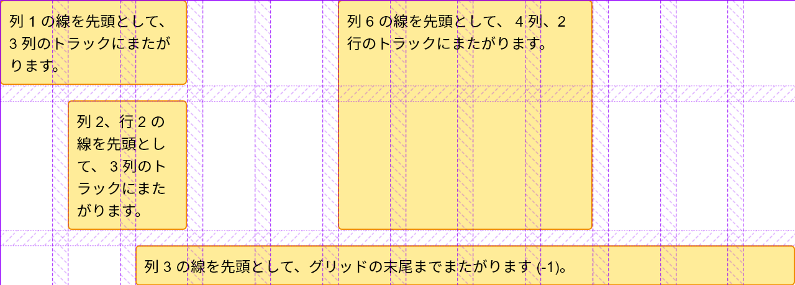
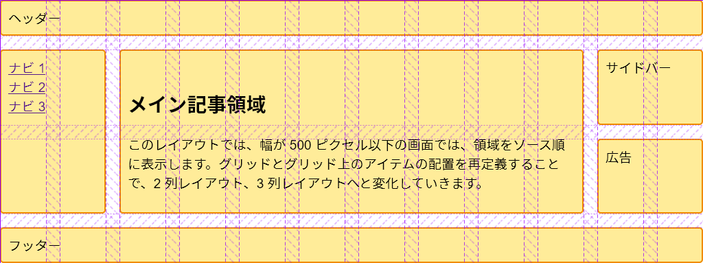

{{CSSRef}}

今回の CSS グリッドレイアウトガイドの締めくくりとして、グリッドレイアウトを使ったデザインのテクニックをいくつか紹介します。ここでは、 [grid-template-areas](/ja/docs/Web/CSS/CSS_Grid_Layout/Grid_Template_Areas) を使った例と、典型的な 12 列の可変グリッドシステム、そして自動配置を使ったアイテムリストを見ていきます。これらの例からわかるように、多くの場合、グリッドレイアウトで望む結果を得るためには複数の方法があります。自分が解決しようとしている問題や、実現しようとしているデザインに合わせて、最も参考になる方法を選んでください。

## `grid-template-areas` を使用した、1 ～ 3 列の流動的なレスポンシブレイアウト

多くのウェブサイトはこの種のレイアウトのバリエーションで、コンテンツ、サイドバー、ヘッダー、フッターを備えています。レスポンシブデザインでは、1 列で表示し、特定のブレイクポイントでサイドバーを追加し、広い画面では 3 列のレイアウトを持ってくるという方法が考えられます。


このレイアウトは、*[グリッドテンプレート領域](/ja/docs/Web/CSS/CSS_Grid_Layout/Grid_Template_Areas)*のガイドで学んだ*名前付きテンプレート領域*を使って作成する予定です。

このマークアップは、ヘッダー、フッター、メインコンテンツ、ナビゲーション、サイドバー、そして広告を掲載するためのブロックの要素を内部に持つコンテナーです。

```css hidden
* {box-sizing: border-box;}
  .wrapper {
    max-width: 1024px;
    margin: 0 auto;
    font: 1.2em Helvetica, arial, sans-serif;
  }

  .wrapper > * {
    border: 2px solid #f08c00;
    background-color: #ffec99;
    border-radius: 5px;
    padding: 10px;
  }

  nav ul {
    list-style: none;
    margin: 0;
    padding: 0;
  }
```

```html
<div class="wrapper">
  <header class="main-head">ヘッダー</header>
  <nav class="main-nav">
    <ul>
      <li><a href="">ナビ 1</a></li>
      <li><a href="">ナビ 2</a></li>
      <li><a href="">ナビ 3</a></li>
    </ul>
  </nav>
  <article class="content">
    <h1>メイン記事領域</h1>
    <p>このレイアウトでは、幅が 500 ピクセル以下の画面では、領域をソース順に表示します。グリッドとグリッド上のアイテムの配置を再定義することで、2 列レイアウト、3 列レイアウトへと変化していきます。</p>
  </article>
  <aside class="side">サイドバー</aside>
  <div class="ad">広告</div>
  <footer class="main-footer">フッター</footer>
</div>
```

レイアウトの作成に {{cssxref("grid-template-areas")}} を使用しています。メディアクエリーを使用せず、領域に名前を付ける必要があります。ここでは {{cssxref("grid-area")}} プロパティを使って領域に名前を付けます。

```css
.main-head {
  grid-area: header;
}
.content {
  grid-area: content;
}
.main-nav {
  grid-area: nav;
}
.side {
  grid-area: sidebar;
}
.ad {
  grid-area: ad;
}
.main-footer {
  grid-area: footer;
}
```

これでレイアウトは作成されませんが、アイテムに名前がついたので、それを使ってレイアウトを作成することができます。 メディアクエリーを使用せずに、これからモバイル幅用のレイアウトを設定します。ここでは、*[グリッドレイアウトとアクセシビリティ](/ja/docs/Web/CSS/CSS_Grid_Layout/CSS_Grid_Layout_and_Accessibility)*のガイドに記載されているように、ソースと表示の間に断絶が生じないように、すべてをソース順にしています。列や行のトラックは定義していませんが、このレイアウトでは 1 つの列が指示されており、行は暗黙のグリッド内の各アイテムに必要に応じて作成されます。

```css
.wrapper {
  display: grid;
  gap: 20px;
  grid-template-areas:
    "header"
    "nav"
    "content"
    "sidebar"
    "ad"
    "footer";
}
```

モバイルレイアウトを設定すると、どの画面サイズでも 1 列になりますが、[メディアクエリー](/ja/docs/Web/CSS/Media_Queries)を追加して、2 列表示できるだけの画面領域がある場合のレイアウトを再定義することができます。

```css
@media (min-width: 500px) {
  .wrapper {
    grid-template-columns: 1fr 3fr;
    grid-template-areas:
      "header  header"
      "nav     nav"
      "sidebar content"
      "ad      footer";
  }
  nav ul {
    display: flex;
    justify-content: space-between;
  }
}
```

{{cssxref("grid-template-areas")}}　の値で、レイアウトの形が見えてきます。`header` は、 `nav` と同様に 2 列のトラックに渡っています。3 列目のトラックには `sidebar` と `content` が一緒に配置されています。4 列目のトラックには、`ad` コンテンツを配置することにしました。サイドバーの下に表示され、コンテンツの下にはその隣の `footer` が表示されます。ナビゲーションにはフレックスボックスを使用して、間隔を空けて一列に表示しています。

最後のブレイクポイントを追加すると、3 列レイアウトに移行することができるようになります。

```css
@media (min-width: 700px) {
  .wrapper {
    grid-template-columns: 1fr 4fr 1fr;
    grid-template-areas:
      "header header  header"
      "nav    content sidebar"
      "nav    content ad"
      "footer footer  footer"
   }
   nav ul {
     flex-direction: column;
   }
}
```

3 列レイアウトでは、`1fr` 単位の側方の列が 2 つと、トラックサイズが `4fr` の中央の列があります。つまり、コンテナー内の空き空間を 6 分割して、3 つのトラックに比例して割り当てています。

このレイアウトでは、左の列に `nav` を `content` と一緒に表示しています。右の列には `sidebar` があり、その下には広告 (`ad`) があります。`footer` は、レイアウトの下部に表示されています。そして、フレックスボックスを使ってナビゲーションを列として表示しています。

{{ EmbedLiveSample('A_responsive_layout_with_1_to_3_fluid_columns_using_grid-template-areas', '800', '500') }}

これは簡単な例ですが、グリッドレイアウトを使って、異なるブレイクポイントでレイアウトを再配置する方法を示しています。特に、 `ad` ブロックの位置を、異なる列設定で適切に変更しています。プロトタイプの段階では、要素の位置を簡単に変更できる、この名前付きエリアの方法がとても便利です。サイトにアクセスするブラウザーの関係上、本番環境では完全に信頼できないとしても、プロトタイピングのためにこの方法でグリッドを使い始めることは可能です。

## 柔軟な 12 列のレイアウト

多くのフレームワークやグリッドシステムを使用している場合、 12 列または 16 列の柔軟なグリッドでサイトをレイアウトすることに慣れているかもしれません。 CSS グリッドレイアウトを使えば、このようなシステムを作ることができます。簡単な例として、 12 列の柔軟なグリッドを作成します。このグリッドには 12 個の `1fr` 単位の列トラックがあり、それらはすべて `col-start` という名前の先頭の線を持っています。つまり、 `col-start` という名前の 12 本のグリッド線があることになります。

```css hidden
.wrapper {
  max-width: 1024px;
  margin: 0 auto;
  font: 1.2em Helvetica, arial, sans-serif;
}
.wrapper > * {
  border: 2px solid #f08c00;
  background-color: #ffec99;
  border-radius: 5px;
  padding: 10px;
}
```

```css
.wrapper {
  display: grid;
  grid-template-columns: repeat(12, [col-start] 1fr);
  gap: 20px;
}
```

このグリッドシステムがどのように機能するかを示すために、ラッパーの中に 4 つの子要素を入れています。

```html
<div class="wrapper">
  <div class="item1">列 1 の線を先頭として、 3 列のトラックにまたがります。</div>
  <div class="item2">列 6 の線を先頭として、 4 列、2 行のトラックにまたがります。</div>
  <div class="item3">列 2、行 2 の線を先頭として、 3 列のトラックにまたがります。</div>
  <div class="item4">列 3 の線を先頭として、グリッドの末尾までまたがります (-1)。</div>
</div>
```

これらをグリッド上に配置するには、名前付きの線や span キーワードを使います。

```css
.item1 {
  grid-column: col-start / span 3;
}
.item2 {
  grid-column: col-start 6 / span 4 ;
  grid-row: 1 / 3;
}
.item3 {
  grid-column: col-start 2 / span 2;
  grid-row: 2;
}
.item4 {
  grid-column: col-start 3 / -1;
  grid-row: 3;
}
```

{{ EmbedLiveSample('A_flexible_12-column_layout', '800', '400') }}

[名前付きグリッド線のガイド](/ja/docs/Web/CSS/CSS_Grid_Layout/Layout_using_Named_Grid_Lines)で説明されているように、アイテムを配置するために名前付きの線を使用しています。同じ名前の行が 12 本あるので、名前、そして行のインデックスを使います。名前付きの線を使わずに、線のインデックスだけを使うこともできます。

最終の線の番号を設定するのではなく、 `span` キーワードを使って、この要素が何トラックにまたがるのかを指定することにしました。複数列のレイアウトシステムで作業をする場合、通常はブロックがまたがるグリッドのトラック数でブロックを考え、異なるブレイクポイントに合わせて調整するので、このアプローチが気に入っています。ブロックがトラックにどのように配置されているかを確認するには、[Firefox グリッドインスペクター](/ja/docs/Tools/Page_Inspector/How_to/Examine_grid_layouts)を使用してください。これは、アイテムがどのように配置されているかを明確に示します。



グリッドレイアウトの仕組みには、これまで使ってきたグリッドシステムとの主な違いがあります。ご覧のように、グリッドシステムでは要素が上の行に飛び出さないようにするために、行を作成するためのマークアップを追加する必要はありません。CSS グリッドレイアウトでは、何もない状態でも上の行に飛び出してくる心配がないので、物を行に配置することができます。この厳密な列と行の配置により、レイアウトの中に簡単に空間を設けることができます。また、グリッドの中で物を引いたり押したり、インデントしたりするための特別なクラスも必要ありません。必要なのは、アイテム先頭の線と末尾の線を指定することだけです。

## 12 列のシステムを使用してレイアウトを作る

このレイアウト方法が実際にどのように機能するかを確認するために、 {{cssxref("grid-template-areas")}} で作成したのと同じレイアウトを、今度は 12 列のグリッドシステムを使って作成してみましょう。ここでは、グリッドテンプレート領域の例で使用したのと同じマークアップで始めます。

```css hidden
* {box-sizing: border-box;}
  .wrapper {
    max-width: 1024px;
    margin: 0 auto;
    font: 1.2em Helvetica, arial, sans-serif;
  }

  .wrapper > * {
    border: 2px solid #f08c00;
    background-color: #ffec99;
    border-radius: 5px;
    padding: 10px;
  }

  nav ul {
    list-style: none;
    margin: 0;
    padding: 0;
  }
```

```html
<div class="wrapper">
  <header class="main-head">ヘッダー</header>
  <nav class="main-nav">
    <ul>
      <li><a href="">ナビ 1</a></li>
      <li><a href="">ナビ 2</a></li>
      <li><a href="">ナビ 3</a></li>
    </ul>
  </nav>
  <article class="content">
    <h1>メイン記事領域</h1>
    <p>このレイアウトでは、幅が 500 ピクセル以下の画面では、領域をソース順に表示します。グリッドとグリッド上のアイテムの配置を再定義することで、2 列レイアウト、3 列レイアウトへと変化していきます。</p>
  </article>
  <aside class="side">サイドバー</aside>
  <div class="ad">広告</div>
  <footer class="main-footer">フッター</footer>
</div>
```

そして、上記の 12 列レイアウトの例のように、グリッドを設定します。

```css
.wrapper {
  display: grid;
  grid-template-columns: repeat(12, [col-start] 1fr);
  gap: 20px;
}
```

今回もレスポンシブレイアウトを採用しますが、今回は名前付き線を使用します。すべてのブレイクポイントで 12 列のグリッドを使用しますが、アイテムがまたがるトラック数は、画面の大きさによって変わります。

まずはモバイルから始めますが、最も狭い画面では、アイテムがソース順に並び、すべてグリッドにまたがるようにしたいと考えています。

```css
.wrapper > * {
  grid-column: col-start / span 12;
}
```

次のブレイクポイントでは、2 列のレイアウトに移行したいと思います。ヘッダーとナビゲーションはグリッド全体を使っているので、それらの位置を指定する必要はありません。サイドバーは、col-start という名前の最初の列の線から始まり、3 本に渡っています。ヘッダーとナビゲーションが最初の 2 つの行トラックにあるので、サイドバーは 3 行目以降になります。

広告パネルは、サイドバーの下にあるので、グリッドの行の4行目から始まります。そして、コンテンツとフッターは col-start 4 から始まり、9 トラックに渡ってグリッドの最後まで続きます。

```css
@media (min-width: 500px) {
  .side {
    grid-column: col-start / span 3;
    grid-row: 3;
  }
  .ad {
    grid-column: col-start / span 3;
    grid-row: 4;
  }
  .content, .main-footer {
    grid-column: col-start 4 / span 9;
  }
  nav ul {
    display: flex;
    justify-content: space-between;
  }
}
```

最後に、このレイアウトの 3 列バージョンを見てみましょう。ヘッダーは引き続きグリッド全体に広がっていますが、ナビゲーションが下に移動して最初のサイドバーとなり、その隣にコンテンツとサイドバーが配置されています。また、フッターもレイアウト全体に広がっています。

```css
@media (min-width: 700px) {
  .main-nav {
    grid-column: col-start / span 2;
    grid-row: 2 / 4;
  }
  .content {
    grid-column: col-start 3 / span 8;
    grid-row: 2 / 4;
  }
  .side {
    grid-column: col-start 11 / span 2;
    grid-row: 2;
  }
  .ad {
    grid-column: col-start 11 / span 2;
    grid-row: 3;
  }
  .main-footer {
    grid-column: col-start / span 12;
  }
  nav ul {
    flex-direction: column;
  }
}
```

{{ EmbedLiveSample('Building_a_layout_using_the_12-column_system', '800', '450') }}

今回も、レイアウトがどのような形になっているかを確認するために、[グリッドインスペクター](/ja/docs/Tools/Page_Inspector/How_to/Examine_grid_layouts)が役に立ちます。



このレイアウトを作成する際に注意すべき点は、各ブレイクポイントですべての要素をグリッド上に明示的に配置する必要がないことです。これは「モバイルファースト」の利点でもあります。また、グリッドの自動配置を利用することもできます。グリッドの自動配置は、要素を論理的な順序で配置することで、アイテムをグリッドに配置するための多くの作業を自動化してくれます。このガイドの最後の例では、自動配置に完全に依存したレイアウトを作成します。

## 自動配置される製品リスト

多くのレイアウトは、アイテムリストやイメージギャラリーなど、基本的に「カード」のセットです。グリッドを使えば、レスポンシブ対応のために[メディアクエリー](/ja/docs/Web/CSS/Media_Queries)を追加しなくても、これらのリストを非常に簡単に作成することができます。次の例では、CSS グリッドとフレックスボックスレイアウトを組み合わせて、シンプルな製品リストのレイアウトを作成しています。

アイテムリストのマークアップは、順不同のアイテムリストです。各項目には、見出し、さまざまな高さのテキスト、コールトゥアクションのリンクが含まれています。

```html
<ul class="listing">
  <li>
    <h2>アイテム 1</h2>
    <div class="body">
      <p>このアイテムのコンテンツがここに来ます。</p>
    </div>
    <div class="cta">
      <a href="">コールトゥアクション</a>
    </div>
  </li>
  <li>
    <h2>アイテム 2</h2>
    <div class="body">
      <p>このアイテムのコンテンツがここに来ます。</p>
    </div>
    <div class="cta">
      <a href="">コールトゥアクション</a>
    </div>
  </li>
  <li class="wide">
    <h2>アイテム 3</h2>
    <div class="body">
      <p>このアイテムのコンテンツがここに来ます。</p>
      <p>こちらは他のアイテムよりも文字数が多いです。</p>
      <p>はるかにたくさん</p>
      <p>何か違うことができるのでは？</p>
    </div>
    <div class="cta">
      <a href="">コールトゥアクション</a>
    </div>
  </li>
  <li>
    <h2>アイテム 4</h2>
    <div class="body">
      <p>このアイテムのコンテンツがここに来ます。</p>
    </div>
    <div class="cta">
      <a href="">コールトゥアクション</a>
    </div>
  </li>
  <li>
    <h2>アイテム 5</h2>
    <div class="body">
      <p>このアイテムのコンテンツがここに来ます。</p>
    </div>
    <div class="cta">
      <a href="">コールトゥアクション</a>
    </div>
  </li>
</ul>
```

```css hidden
* {box-sizing: border-box;}
    img {max-width: 100%; display: block;}
    body {
        font: 1.2em Helvetica, arial, sans-serif;
    }
    a:link, a:visited {
      text-decoration: none;
      color: #f08c00;
    }

    h2 {
      background-color: #f08c00;
      color: #fff;
      text-align: center;
      margin: 0;
      padding: 20px;
    }
```

ここでは、列数の自由度が高いグリッドを作成します。 200 ピクセル以下にならないようにして、残った空間を均等に分け合うようにして、常に同じ幅の列トラックを得るようにします。これを実現するには、トラックのサイズ調整のための反復記法で、`minmax()` 関数を使用します。

```css
.listing {
  list-style: none;
  margin: 2em;
  display: grid;
  gap: 20px;
  grid-template-columns: repeat(auto-fill,minmax(200px, 1fr));
}
```

この CSS を追加すると、すぐにアイテムがグリッド状に配置されるようになりました。ウィンドウを小さくしたり大きくしたりすると、列の数が変わりますが、メディアクエリーを使ってブレイクポイントを追加したり、グリッドを再定義したりする必要はありません。

その後、フレックスボックスを少し使ってボックスの内部を整理します。リストアイテムを `display: flex` に設定し、 `flex-direction` を `column` に設定します。そして、`.cta` に auto マージンを使用して、このバーをボックスの下まで押し込みます。

```css
.listing li {
  border: 1px solid #ffe066;
  border-radius: 5px;
  display: flex;
  flex-direction: column;
}
.listing .cta {
  margin-top: auto;
  border-top: 1px solid #ffe066;
  padding: 10px;
  text-align: center;
}
.listing .body {
  padding: 10px;
}
```

これが、グリッドではなくフレックスボックスを使用する主な理由の 1 つです。単一の次元で何かを整列させたり配置したりする場合は、フレックスボックスの使用例になります。

{{ EmbedLiveSample('A_product_listing_with_auto-placement', '800', '900') }}

## dense キーワードで隙間を防ぐ

これでもかなり完成度が高いのですが、時々、他のカードよりもはるかに多くのコンテンツを含むカードがあります。このようなカードは、 2 つのトラックにまたがるようにすれば、それほど高くならずに済むかもしれません。大きなアイテムはクラスを `wide` とし、ルールとして {{cssxref("grid-column-end")}} を `span 2` の値で追加しました。これで、グリッドがこのアイテムに遭遇すると、 2 つのトラックが割り当てられます。ブレークポイントによっては、2 トラックのアイテムを配置するスペースがないため、グリッドに隙間ができてしまうことになります。


グリッドコンテナーに {{cssxref("grid-auto-flow")}}`: dense` を設定することで、グリッドがこれらの隙間を埋め合わせることができます。しかし、これを行うと、アイテムが論理的なソースの順序から外れてしまうので、注意が必要です。これは、アイテムの順序が決まっていない場合にのみ行うべきです。また、タブの順序がソースに従ったものになり、並び替えた表示にはならないという[問題](/ja/docs/Web/CSS/CSS_Grid_Layout/CSS_Grid_Layout_and_Accessibility#視覚的な、しかし論理的ではない並べ替え)にも注意してください。

```html hidden
<ul class="listing">
  <li>
    <h2>アイテム 1</h2>
    <div class="body"><p>このアイテムのコンテンツがここに来ます。</p></div>
    <div class="cta"><a href="">コールトゥアクション</a></div>
  </li>
  <li>
    <h2>アイテム 2</h2>
    <div class="body"><p>このアイテムのコンテンツがここに来ます。</p></div>
    <div class="cta"><a href="">コールトゥアクション</a></div>
  </li>
  <li class="wide">
    <h2>アイテム 3</h2>
    <div class="body"><p>このアイテムのコンテンツがここに来ます。</p>
      <p>こちらは他のアイテムよりも文字数が多いです。</p>
      <p>はるかにたくさん</p>
      <p>何か違うことができるのでは？</p></div>
    <div class="cta"><a href="">コールトゥアクション</a></div>
  </li>
  <li>
    <h2>アイテム 4</h2>
    <div class="body"><p>このアイテムのコンテンツがここに来ます。</p></div>
    <div class="cta"><a href="">コールトゥアクション</a></div>
  </li>
  <li>
    <h2>アイテム 5</h2>
    <div class="body"><p>このアイテムのコンテンツがここに来ます。</p></div>
    <div class="cta"><a href="">コールトゥアクション</a></div>
  </li>
</ul>
```

```css hidden
* {box-sizing: border-box;}
    img {max-width: 100%; display: block;}
    body {
        font: 1.2em Helvetica, arial, sans-serif;
    }
    a:link, a:visited {
      text-decoration: none;
      color: #f08c00;
    }

    h2 {
      background-color: #f08c00;
      color: #fff;
      text-align: center;
      margin: 0;
      padding: 20px;
    }

.listing li {
  border: 1px solid #ffe066;
  border-radius: 5px;
  display: flex;
  flex-direction: column;
}
.listing .cta {
  margin-top: auto;
  border-top: 1px solid #ffe066;
  padding: 10px;
  text-align: center;
}
.listing .body {
  padding: 10px;
}
```

```css
.listing {
  list-style: none;
  margin: 2em;
  display: grid;
  gap: 20px;
  grid-auto-flow: dense;
  grid-template-columns: repeat(auto-fill,minmax(200px, 1fr));
}
.listing .wide {
  grid-column-end: span 2;
}
```

{{ EmbedLiveSample('Preventing_gaps_with_the_dense_keyword', '800', '900') }}

このように、特定の項目にルールを適用して自動配置を行う手法は非常に便利で、例えば CMS で出力されたコンテンツに繰り返し項目がある場合、 HTML にレンダリングされる際に特定の項目にクラスを追加することができます。

## さらなる探求

グリッドレイアウトを使いこなすには、ここで紹介したようなサンプルを作り続けるのが一番です。普段使っているフレームワークや浮動要素を使って作っているものを、グリッドを使って作れるかどうか試してみてください。また、現在の方法では作ることができない例を探すことも忘れてはいけません。雑誌やウェブ以外のものからインスピレーションを得るのもいいでしょう。グリッドレイアウトは、今までにない可能性を秘めています。古いレイアウトに縛られることなく、ぜひ活用してみてください。

- インスピレーションを得るには、 [_Layout Labs_ from Jen Simmons](https://labs.jensimmons.com/) を参照してください。彼女はさまざまなソースに基づいてレイアウトを作成しています。
- その他の一般的なレイアウトパターンについては、 _[Grid by Example](https://gridbyexample.com)_ を参照してください。ここには、グリッドレイアウトの多くの小さな例や、より大きな UI パターンやフルページレイアウトがあります。
